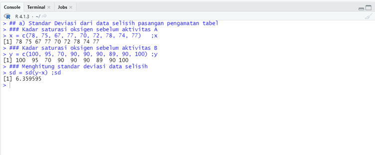
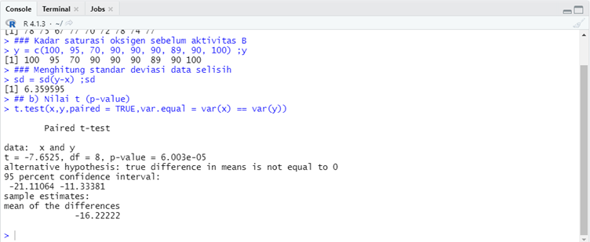
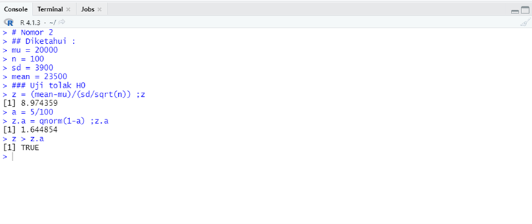
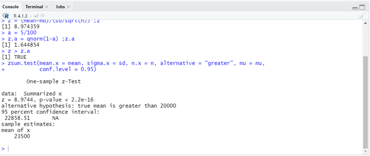
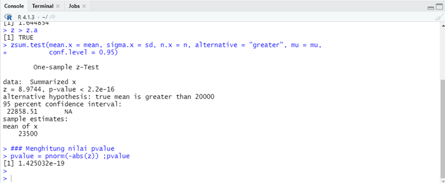
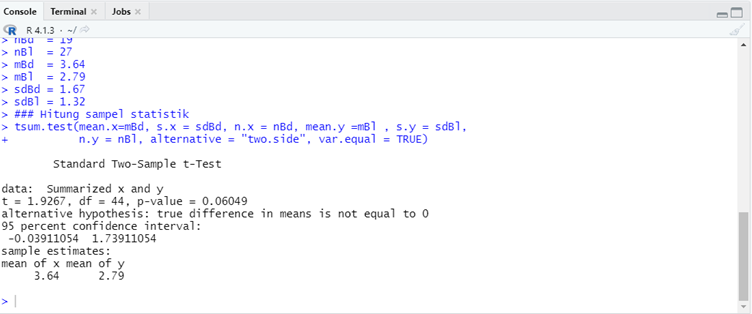
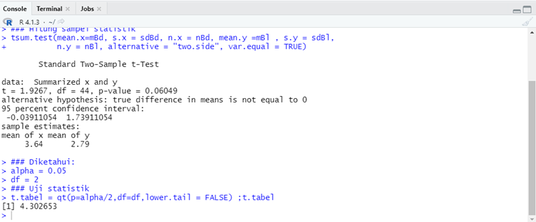
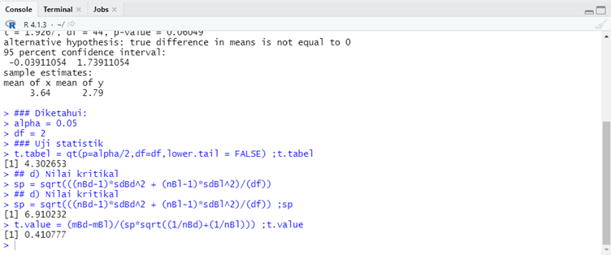

# P2_Probstat_E_5025201228
## Laporan Praktikum Modul 2 Probabilitas dan Statistik 2022
### Estimasi Parameter, Uji Hipotesis, dan ANOVA

- **Nama  : Arief Badrus Sholeh**

- **NRP   : 5025201228**

- **Kelas : Probabilitas dan Statistik E**

***

## Soal 1

Seorang peneliti melakukan penelitian mengenai pengaruh aktivitas 𝐴 terhadap kadar saturasi oksigen pada manusia. Peneliti tersebut mengambil sampel sebanyak 9 responden. Pertama, sebelum melakukan aktivitas 𝐴, peneliti mencatat kadar saturasi oksigen dari 9 responden tersebut. Kemudian, 9 responden tersebut diminta melakukan aktivitas 𝐴. Setelah 15 menit, peneliti tersebut mencatat kembali kadar saturasi oksigen dari 9 responden tersebut.

### a) Standar Deviasi dari data selisih pasangan pengamatan tabel

``` r
## Kadar saturasi oksigen sebelum aktivitas A
x = c(78, 75, 67, 77, 70, 72, 78, 74, 77)   ;x

## Kadar saturasi oksigen sebelum aktivitas B
y = c(100, 95, 70, 90, 90, 90, 89, 90, 100) ;y

## Menghitung standar deviasi data selisih
sd = sd(y-x) ;sd
```



**Hasil**

- sd (standar deviasi) = 6.359595

**Penjelasan**

Variabel x berisi data nilai kadar saturasi oksigen sebelum aktivitas A. Variabel y berisi data nilai kadar saturasi oksigen sebelum aktivitas B. Menghitung nilai standar deviasi menggunakan `sd()` dengan parameter selisih pasangan data `y-x`.

### b) Nilai t (p-value)

``` r
t.test(x,y,paired = TRUE,var.equal = var(x) == var(y))
```



**Hasil**

- t = -7.6525
- p-value = 6.003e-05

**Penjelasan**

Pencariang menggunakan `t.test()` dengan parameter `paired` bernilai `true` karena data x dan data y merupakan pasangan data tabel serta parameter `var.equal` bernilai dari perbandingan varian data x `var(x)` dan varian data y `var(y)`.

### c) Tentukanlah apakah terdapat pengaruh yang signifikan secara statistika dalam hal kadar saturasi oksigen, sebelum dan sesudah melakukan aktivitas A

Diketahui : 

- tingkat signifikansi `𝛼 = 5%`
- `H0` : "tidak ada pengaruh yang signifikan secara statistika dalam hal kadar saturasi oksigen, sebelum dan sesudah melakukan aktivitas A.

**Penjelasan**

- Pada soal b didapatkan nilai `p-value = 6.003e-05`
- Karena `p-value > 0,06` atau `p-value > 𝛼`, maka `H0` ditolak.
- Berlaku `H1` diterima sebagai hipotesis, "Terdapat pengaruh yang signifikan secara statistika dalam hal kadar saturasi oksigen, sebelum dan sesudah melakukan aktivitas A".

***

## Soal 2

Diketahui bahwa mobil dikemudikan rata-rata lebih dari 20.000 kilometer per tahun. Untuk menguji klaim ini, 100 pemilik mobil yang dipilih secara acak diminta untuk mencatat jarak yang mereka tempuh. Jika sampel acak menunjukkan rata-rata 23.500 kilometer dan standar deviasi 3900 kilometer. (Kerjakan menggunakan library seperti referensi pada modul).

### a) Apakah Anda setuju dengan klaim tersebut?

``` r
## Diketahui :
mu = 20000
n = 100
sd = 3900
mean = 23500

## a) Apakah setuju dengan klaim?

### Uji tolak H0
z = (xbar-mu)/(sd/sqrt(n)) ;z

a = 5/100
z.a = qnorm(1-a) ;z.a

z > z.a
### Setuju, penjelasan di Github
```



**Penjelasan**

- `H0` : mu <= 20000
- `H1` : mu > 20000
- Setelah dilakukan uji tolak `H0` didapatkan bahwa `z > z.a` bernilai true, maka `H0` ditolak.
- Sehingga berlaku `H1` : "mobil dikemudikan rata-rata lebih dari 20.000 kilometer per tahun".

**Kesimpulan**

- **Setuju**

### 2) Jelaskan maksud dari output yang dihasilkan!

``` r
## b) Maksud dari output

zsum.test(mean.x = mean, sigma.x = sd, n.x = n, alternative = "greater", mu = mu,
          conf.level = 0.95)
### Penjelasan di Github
```



**Penjelasan**

Menggunakan `zsum.test()` dengan parameter `alternative` bernilai "greater" karena "mobil dikemudikan rata-rata lebih dari 20.000 kilometer per tahun".

Maksud dari output diatas adalah diperoleh nilai zhitung `z = 8.9744` yang mana hal ini sama dengan perhitungan z menggunakan rumus z statistik pada 2a) yang menghasilkan `z = 8.974359`. Nilai zhitung tersebut melebihi nilai ztabel (z.a) sehingga kesimpulan yang diambil adalah "rata-rata mobil dikemudikan lebih dari 20.000 kilometer per tahun". Diperoleh juga nilai `p-value < 2.2e-16`. Serta nilai selang atas kepercayaan rata rata berada pada nilai `22848.51`.


### 3) Buatlah kesimpulan berdasarkan P-Value yang dihasilkan!

``` r
### Menghitung nilai pvalue
pvalue = pnorm(-abs(z)) ;pval
### Kesimpulan di github
```



**Hasil**

- p-value = 1.425032e-19

**Penjelasan**

Menggunakan `pnorm()` untuk mendapatkan nilai dari p-value. Karena nilai p-value > a(0.05), maka keputusan yang diambil adalah tolak `H0`, sehingga berlaku ""rata-rata mobil dikemudikan lebih dari 20.000 kilometer per tahun".

***

## Soal 3

Dari data yang diberikan berilah keputusan serta kesimpulan yang didapatkan dari hasil. Asumsikan nilai variancenya sama, apakah ada perbedaan pada rata-ratanya `(α= 0.05)`? Buatlah :

### a) H0 dan H1

- Hipotesis Awal `H0` : "Rata-rata saham di bandung **sama** dengan di Bali" / `H0` : mBd = mBl.
- Hipotesis alternatif `H`' : "Rata-rata saham di bandung **tidak sama** dengan di Bali / `H` : mBd != mBl"

### b) Hitung Sampel Statistik

``` r
### Diketahui:
nBd  = 19
nBl  = 27
mBd  = 3.64
mBl  = 2.79
sdBd = 1.67
sdBl = 1.32

### Hitung sampel statistik
tsum.test(mean.x=mBd, s.x = sdBd, n.x = nBd, mean.y =mBl , s.y = sdBl, 
          n.y = nBl, alternative = "two.side", var.equal = TRUE)
```



**Penjelasan**

Dilakukan t test menggunakan `tsum.test()` dengan parameter `alternative = "two.side` karena data yang diuji memiliki nilai rata-rata yang tidak sama dan `var.equal = TRUE` karena asumsi nilai varian sama.

### c) Lakukan Uji Statistik (df =2)

``` r
### Diketahui:
alpha = 0.05
df = 2

### Uji statistik
t.tabel = qt(p=alpha/2,df=df,lower.tail = FALSE) ;t.tabel
```



**Penjelasan**

Melakukan uji statistik (df = 2) menggunakan `qt()` dengan nilai p dibagi dua karena dilakukan pengujian secara 2 arah.

### d) Nilai Kritikal

``` r
sp = sqrt(((nBd-1)*sdBd^2 + (nBl-1)*sdBl^2)/(df)) ;sp
t.value = (mBd-mBl)/(sp*sqrt((1/nBd)+(1/nBl))) ;t.value
```



**Hasil**

- sp = 6.910232
- t.value = 0.410777

**Penjelasan**

Menghitung nilai kritikal menggunakan persamaan statistik https://www.slideshare.net/azendlove/pengantar-statistika-4

### e) Keputusan

- Nilai t.value yang diperoleh sama dengan `0.410777`. Masih berada diantara nilai t.tabel (`-4.30265 < T < 4.30625`)

### f) Kesimpulan

- `H0` : "Rata-rata saham di bandung sama dengan rata - rata saham di Bali" **diterima**.

*** 

## Soal 4

***

## Soal 5

***

## ***Sekian dan Terima Kasih***